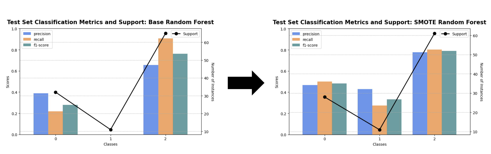

# From College to the NFL: A Data-Driven Approach to Predicting Wide Receiver Success

## Introduction and Executive Summary
In this project, I strived to predict the success of NFL wide receivers based on data from their college football careers and draft outcomes. Collecting data from two open-source APIs for the years 2004-2023, I achieved this goal by developing multiple decision tree and random forest models, which I further calibrated with RFECV to optimize the features used and SMOTE to handle the severe class imbalance. Ultimately, the SMOTE-enhanced random forest model achieved the highest accuracy, with a 66% success rate in predicting whether a wide receiver would become a low, average, or high performer in the NFL. Behind this, ESPN's annual pre-draft grade and wide receiver positional rankings emerged as the primary drivers behind the model's predictive accuracy. However, the various models I created were subject to a few statistical caveats including class imbalance and sample bias. Together, the various statistical challenges I faced thoughout this project underscore the importance of addressing statistical challenges in order to increase predictive accuracy in analytics.

## Data Collection and Processing
Using CFBD and NFL-data-py, two open-source APIs, I collected three comprehensive datasets consisting of college football, NFL, and draft statistics between 2004-2023, where I focused on the wide receiver positon due to its comparitevely greater abundance of data. I then cleaned, standardized, and ultimately merged the three datasets into one aggregate source using a name-year identifier that I created for each athlete, since the two independent APIs did not share a common ID.

## Methodology
After plotting the correlation between the sum of athletes' z-scores across the key football metrics (receiving yards, receptions, and touchdowns) and determining that there was no strong linear or polynomial relationships present, I used K-Means clustering to instead group athletes into three classes of low, average, and high performers. Therefore, to create a classification model, I used decision trees and random forests, which were optimized through Recursive Feature Elimination with Cross Validation (RFECV) and hyperparameter tuning. 

Given the combination of sample bias from the open-source APIs inability to capture the entire population of wide recievers during the sourced timeframe, along with the class imbalances stemming from the limited number of high-performing players, I applied Synthetic Minority Oversampling Technqiue (SMOTE) to enhance the data. By synthetically generating samples of the minority classes, SMOTE helped improve the overall accuracy of the model by handling the class imbalance more effectively than the base versions of the respective models.

## Results
The most successful model, the SMOTE-enhanced random forest, achieved an overall accuracy of 66%, with the two primary predictors being ESPN's pre-draft grade and positional ranking. Enhancing the data with SMOTE significantly improved the model's performance over the base version since it addressed the data's class imbalances. Below are the classification reports of the random forests with and without the SMOTE enhancement.

  

As shown, the SMOTE-enhanced model demonstrated improved precision, recall, and F1-scores across each class, particularly for the high performing athletes, which the base random forest model failed to correctly classify at all. 

Regarding the key drivers, the following figure anlyzes the model's top five features by their Mean Decrease in Impurity (MDI) and Mean Decrease in Accuracy (MDA).

  

As depicted in the above chart, ESPN's pre-draft grade and positional ranking are the features with the highest combined MDI and MDA in my model, suggesting that they are interestingly accurate predictors of wide receiver success in the NFL.

## Discussion
While the models I created indicate that there are in fact certain college football metrics and draft information that can predict NFL success, my results and conclusions are subject to statistical caveats including a limited generalizability and assumptions introduced from using using SMOTE. Given that the initial data I sourced did not capture the entire population and that I later filtered out any college athletes who did not perform well enough to be drafted, my insights and predictions from the model may not fully apply to the performance of all wide receivers.

Additionally, by using SMOTE to address the severe class imbalance present in the data, I introduced assumptions of independence between the synthetic samples and my original data. If these assumptions did not hold in actuality, it could have caused overfitting of the features in my model and biased the model's overall accuracy.

## Conclusion and Future Work
Overall, this project estalishes a comprehensive baseline for predicting NFL success from data on college and draft statistics. Both using a larger, more representative sample in addition to increasing the model's sophistication to incorporate more complex factors such as mental stamina could significantly improve the model moving forward. Together, these two enhancements would mitigate the existing statistical caveats and integrate more qualitative relationship into the conclusions, which would ultimatley increase the overall accuracy.

## Call to Action
Explore the full report [here], which expands on the above analysis and provides a more detailed documentation my decisions.

Please contact me at bhs.stoller@gmail.com for more information.
