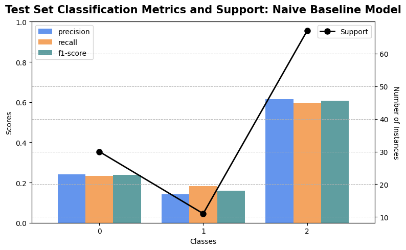
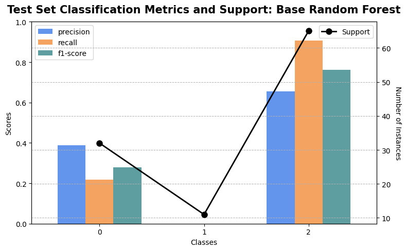
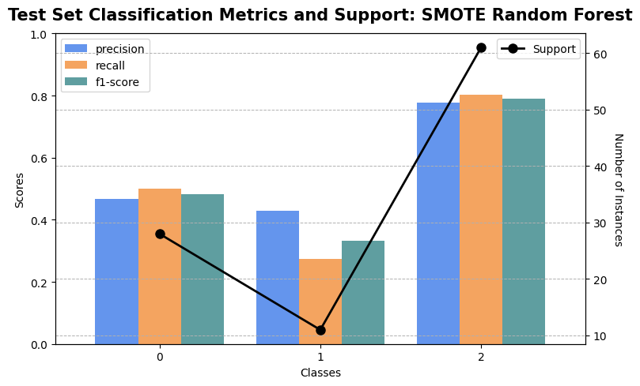

# From College to the NFL: A Data-Driven Approach to Predicting Wide Receiver Success (Full Report)

## Project Abstract and Objectives:
My project hypothesis was that College Football (CFB) yearly player statistics and National Football League (NFL) draft information could predict pro-level (NFL) player success. Utilizing three comprehensive datasets sourced from the CFBD and NFL-data-py open APIs, the following project tests this hypothesis by employing advanced machine learning methods and models. Analyzing data from 2004-2023, I focused on the wide receiver position, which had a significantly greater abundance of data available as compared to the other positions represented. I began this project with a data processing and cleaning phase followed by an extensive exploratory data analysis (EDA) to identify the key performance metrics and interdependencies within the three different datasets I collected. Then, I developed machine learning models, including decision trees and random forests, which were calibrated using techniques such as RFECV to select the best features and SMOTE to address the present class imbalances. While the models ultimately exhibited a moderate predictive success, they were limited by statistical obstacles such as class imbalances, sample biases, and data skewnesses. This underscores the importance of addressing statistical challenges to maximize the effectiveness of predictive modeling in sports analytics.

## Table of Contents:
- [Data Collection](#data-collection)
- [Data Processing](#data-processing)
- [Exploratory Data Analysis](#exploratory-data-analysis)
  - [Boxplot Analysis of NFL and College Football Athlete Performance Across Key Metrics](#boxplot-analysis-of-nfl-and-college-football-athlete-performance-across-key-metrics)
  - [Draft Pick Analysis by College Team, College Conference, and State](#draft-pick-analysis-by-college-team-college-conference-and-state)
  - [Draft Pick Analysis Across Rounds by College Team, College Conference, and State](#draft-pick-analysis-across-rounds-by-college-team-college-conference-and-state)
- [Regression and Correlation Analysis](#regression-and-correlation-analysis)
- [Adjusted Success Cutoff Analysis](#adjusted-success-cutoff-analysis)
  - [K-Means Clustering Implementation](#k-means-clustering-implementation)
  - [Within-Cluster Exploratory Data Analysis](#within-cluster-exploratory-data-analysis)
- [Feature Engineering](#feature-engineering)
  - [Feature Ideation](#feature-ideation)
  - [Feature Analysis](#feature-analysis)
- [Predictive Modeling and Analysis](#predictive-modeling-and-analysis)
  - [Naive Baseline Model](#naive-baseline-model)
  - [Base Model Implementations](#base-model-implementations)
    - [Decision Tree](#decision-tree)
    - [Random Forest](#random-forest)
  - [SMOTE Model Implementations](#smote-model-implementations)
    - [Decision Tree](#decision-tree-1)
    - [Random Forest](#random-forest-1)
- [Statistical Flaws](#statistical-flaws)
  - [Sample Bias](#sample-bias)
  - [Class Imbalance](#class-imbalance)
  - [Arbitrary Outcomes](#arbitrary-outcomes)
  - [Skewed Data](#skewed-data)
- [Conclusion](#conclusion)

## Data Collection:
When collecting the CFB, NFL, and draft datasets, I utilized two open-source APIs (CFBD and NFL-data-py) to collect information for the years 2004-2023. Using the CFBD API, I was able to source both the CFB and draft information, resulting in datasets of size 88.4 MB (1,014,828 rows) and 734 KB (5,106 rows), respectively. The CFB dataset contains yearly CFB statistics by athlete, and the draft dataset includes both qualitative and quantitative information for each athlete drafted to the NFL since 2004. Separately, by utilizing the NFL-data-py API, I also sourced a dataset of size 27.9 MB (99,059 rows) containing weekly NFL statistics by athlete.

## Data Processing:
With the data collected, I began by ingesting each of the three datasets and performing an initial cleanse. Specifically, for each dataset I adjusted column names and order, ensured the correct type across columns, and dropped any rows with null values in each column. Following the data ingestion, I searched for the football position(s) most represented across each of the three datasets. After determining this to be the wide receiver position, I dropped all information about the other positions from each of the datasets. After appropriately aggregating both the CFB and NFL datasets to represent statistics by year, I grouped by athlete to represent performance by career. With each dataset now containing a unique number of athletes, I filtered out any wide receivers who did not appear in each of the three datasets. Lastly, I merged all three datasets in advance of my exploratory data analysis.

*Filtration and Merge Note*: Since the datasets were pulled from separate sources, there did not exist a shared identification number among the athletes. As a result, I conjoined the normalized athletes names (first_last) with each athlete's first year in the NFL, which is the same as their draft year and the year after their last college season. Thus, I then filtered and merged on that conjoined name_year pair string rather than an identification number. However, I then created a new shared ID named 'common_athlete_id' for each athlete in the dataset for any future merging/aggregation.

## Exploratory Data Analysis: 
With a clean set of data, and before developing any machine learning models, I performed an exploratory data analysis to better understand the information as it was collected. Specifically, I analyzed the numerical performance of NFL and CFB athletes, in addition to comparing their draft outcomes based on various background factors (college team, hometown state, and college conference). I then further examined how those same background factors influenced their selection by total draft picks and by draft round.

### Boxplot Analysis of NFL and College Football Athlete Performance Across Key Metrics

  

In football, wide receivers are primarily evaluated based on three main metrics: receiving yards, receptions, and touchdowns. This figure serves to compare the performance of CFB and NFL wide receivers both by year and by their respective careers across each of these three metrics. The yearly performance comparison (top row) show that while the first quartile metrics are similar, the median and third quartile values earned by NFL athletes are meaningfully higher than those earned by CFB athletes. This suggests that there exists not only a broader spectrum of success, but also a generally stronger numerical performance across the board for NFL wide receivers. In contrast, at the career level (bottom row), the median performance of those same CFB athletes exceeded the NFL wide receivers. This indicates that, on average, CFB athletes accumulate higher statistics over the duration of their careers. While unanswered solely by the insights from these boxplots, this discrepancy is likely explained by the combination of the higher difficulty in the NFL as well the significantly larger number of CFB teams, which results in more opportunities for playtime at the college level.

### Draft Pick Analysis by College Team, College Conference, and State
The following three figures analyze draft outcomes by detailing the number of NFL draft picks from the top ten colleges (CFB team), conferences (CFB conference), and hometown states.

  
  
  

When comparing these figures to the member colleges within each conference and their respective location, a key link emerges across the three charts. Specifically, five of the schools (Georgia, LSU, Alabama, South Carolina, and Florida) included in the graph counting draft picks by college are members of the SEC conference, which unsurprisingly contains the largest number of athletes drafted. Among the remaining three schools, Ohio State and Oklahoma belong to the Big 10 and Big 12 conferences, respectively, which have the second and third most athletes drafted during this period.

Furthermore, seven of the ten states (Texas, Florida, Georgia, Alabama, South Carolina, Louisiana, and Tennessee) with the highest number of draft picks contain a SEC college. Given that each of the ten schools with the most draft picks, except Notre Dame, are public universities, it is plausible that a meaningful number of athletes attended the college in their home state. If true, this would explain the observed correlation between states and college conference as it relates to the total number of draft picks. 

### Draft Pick Analysis Across Rounds by College Team, College Conference, and State
The three figures below take this draft analysis one step further, now examining insights at the round level. Specifically, they detail the number of draft picks by round for the top eight colleges, five conferences, and five states, respectively.

  
  
  

Despite producing comparatively fewer draft picks in rounds 2-7, Alabama has approximately 33% more athletes drafted in the first round than any other school, notably USC. This graph suggests that Alabama has a unique ability to produce wide receivers viewed as "top-tier" and thereby drafted in the first round. Thus, if future analyses establish a correlation between first round draft picks and success in the NFL, then Alabama could be particularly effective at producing successful wide receivers

In terms of draft picks by round for the top eight conferences, the SEC consistently outperforms its peers, generating nearly as many or more athletes in each round. The SEC's performance at both the round and aggregate level underscores its strong capacity to produce potential NFL talent.

Lastly, Texas stands out as the most successful state at producing drafted athletes, not only in aggregate (as seen above), but also consistently by round. Given its size and population rank among the other US states, it is unsurprising that Texas has large pool of potential athletes, which helps explain its ability to generate the highest number of draft picks.

*Aggregation Note*: In the first graph, I included the top eight colleges rather than only the top five to highlight the interesting insight regarding Alabama, which otherwise would not have been captured in a top-five list.

## Regression and Correlation Analysis:
As the first step in forecasting the success of NFL wide receivers, as well as establishing a foundation for future predictive modeling, I prepared the data to calculate an initial correlation in terms of a Pearson coefficient. To begin, I merged the NFL and CFB career datasets with the draft data on the common athlete ID to create one aggregate dataset.

However, before examining a correlation, I needed to first address not only the varying scales across the four key CFB and NFL metrics, but also the different distributions within those same metrics at the college versus professional levels. Additionally, I recognized that success in the NFL is not one dimensional and could therefore not be accurately captured by any single metric. Thus, I standardized the key metrics and computed a composite score for each athlete comprised of the sum of their z-scores, which I then used as a proxy for success as a wide receiver.

With both a CFB and NFL composite score for each athlete, I was able to appropriately examine the correlation as a first approach to predicting success in the NFL. The figure below shows the scatterplot of the CFB and NFL composite scores with a line of best fit overlaid to demonstrate the linear relationship between the two variables.

  

As evidenced by the positive slope of 0.23 seen in the figure legend, there exists a weak, positive correlation between CFB and NFL composite scores. While this correlation coefficient does indicate that higher NFL composite scores generally coincide with higher CFB composite scores, this relationship is fairly modest. This is further demonstrated by the non-linear shape of the scatterplot, where the data points exhibit a wide degree of dispersion, indicating that there is considerable variability between the CFB and NFL composite scores.

Given this weak linear relationship, I further examined whether a polynomial (quadratic or cubic) relationship might better describe the data. The figure below shows the same scatterplot of the CFB and NFL composite scores, but with quadratic and cubic lines of best fit overlaid to highlight any potential polynomial relationships present between the two variables.

  

From the figure, it is clear that there do not exist any apparent quadratic or cubic relationships between the CFB and NFL composite scores. The very low R² values of 0.04 and 0.05 for the quadratic and cubic regressions, respectively, mean that these polynomial models only explain approximately 4-5% of the variance in NFL success. This indicates that neither a quadratic nor cubic fit will effectively help me predict NFL outcomes for CFB wide receivers.

Ultimately, the linear, quadratic, and cubic relationship analyses from the two figures above indicate that a meaningful amount of variation in NFL success cannot be explained by only a linear or polynomial relationship. While the first figure suggests that there is some linear relationship between CFB and NFL wide receiver performance as is represented by their composite scores, a linear regression will fail to capture a wide degree of the variation in success. Similarly, the low R² values for the quadratic and cubic fits further reveal that other factors beyond CFB and NFL performance across these four metrics will likely have significant impacts on wide receiver performance. Thus, more complex machine learning models are necessary to effectively predict performance in the NFL.

## Adjusted Success Cutoff Analysis:
Given that more complex machine learning approaches, such as decision tree and random forest models, require a more binary outcome for success rather than only a quantitative correlation, I aimed to find a new method of defining success.

### K-Means Clustering Implementation
To achieve this, I performed a K-Means clustering analysis of the career-level NFL data to reveal any natural groupings of player performance. The figure below shows an elbow chart that I used to determine the optimal 'K', or optimal clusters within the data.

  

When analyzing an elbow chart, the optimal number of clusters, or 'K', exists at the point where the inertia shifts and the graph begins decreasing linearly. The above elbow chart for NFL career data indicates that this shift (elbow) occurs at K=3, or at three clusters. Partitioning the data into three distinct groups, namely low, average, and high performers, aligns closely with the categorization commonly used by scouts and other NFL evaluators to grade athletes.

### Within-Cluster Exploratory Data Analysis
To confirm the validity of this K-Means suggested grouping and analyze the within-cluster athlete performance, I conducted another round of exploratory data analysis, beginning with athlete production across the NFL metrics used in the K-Means algorithm. Specifically, I began by plotting a principal component analysis (PCA) to visualize the clusters in a two-dimensional space, as shown in the figure below.

  

Looking at the PCA, it is seen that the class of high performers (cluster 1) exhibits the most separation amongst the three groupings. While they do not fully overlap, the PCA plot does show that the low and average performers (clusters 0 and 2) somewhat blend together at the boundaries of their respective performance groupings. To explore this further, the figure below offers a different two-dimensional depiction by charting scatterplots of performance by cluster for each combination of the included metrics. Within each of the scatterplots, the athlete data points are color coded according to their cluster, and the centroid stars indicate the average values within those respective clusters.

  

In terms of the metric relationships, the scatterplot in the top left reveals a strong, positive correlation, which is grounded by the fact that athletes who record more receptions generally also yield more receiving yards. Similarly, the scatterplot in the bottom left, reveals a moderate, positive correlation between receptions and touchdowns. Although athletes with more receptions generally also score more touchdowns, the clustering delineates a few exceptions, such as in the bottom left scatterplot, which highlights the variation in NFL performance. In contrast, the scatterplots that include average yard per reception (top right, bottom center, and bottom right) suggest the existence of non-linear relationships. If these relationships are in fact non-linear, it could suggest the presence of athletes with different team roles or playing styles.

To further explore the within-cluster performance in a similar manner to the initial exploratory data analysis, the following boxplots compare performance across the three main football metrics for each grouping.

  

The insights from this figure further confirm the stark difference in performance across each of the three clusters. Metric performance by the high performers consistently dwarfs that of the low performers, often by an average multiple of 17. However, it is particularly interesting to compare the variation between the high and low performer distributions. Specifically, the boxplots reveal a narrow distribution for the low performers cluster, which is contrasted by the very wide distribution among the high performers.

Overall, the analysis of the scatterplots and boxplots confirm the validity of partitioning NFL wide receivers into three performance clusters. Thus, with a clear definition of success, I could begin to utilize more advanced machine learning models.

## Feature Engineering:
Bolstered by a stronger and more-nuanced understanding of the data, I commenced with feature engineering, which consisted of two main steps: feature ideation and feature analysis. In the feature ideation stage, I applied feature engineering best practices to create a comprehensive set of attributes available to a future machine learning model. Then, in the feature analysis stage, I compared that set of features against the clusters to assess an initial impact.

### Feature Ideation
Before deploying a machine learning model to predict NFL success, I prioritized feature ideation to enrich the aggregate dataset with a diverse set of features that could aid in a model's learning potential. Specifically, I added three main categories of features: interactive, polynomial, and one-hot encoded.

<ins>Interactive Features:</ins> Leveraging my prior football knowledge, I added features that would attempt to capture more complex interactions among existing attributes in the aggregate dataset including:
- Physical Attributes: Given the importance of height and weight in evaluating draft prospects, I added an interaction between these two attributes.
- Performance Metrics: To capture player scoring potential and usage, I developed interactions between receiving yards and touchdowns and receptions with touchdowns.
- Draft Attributes: To provide a more multi-dimensional analysis of each athlete's draft context, I created interactions between each player's pre-draft grade, draft round, and overall draft pick.

<ins>Polynomial Features:</ins> To incorporate any potential non-linear relationships between existing attributes, I expanded the feature set to include polynomial transformations of the primary draft attributes. Specifically, this includes both squared and cubed versions of each player's draft round and overall draft pick.

<ins>Encoded Features:</ins> Lastly, in order to further capture the importance of height and weight as draft prospect attributes, I implemented one-hot encoding to categorize players into bins based on the z-score of their respective height and weights. One-hot encoding enabled me to transform static physical measurements into categorical features, thereby enhancing a model's predictive engine.

### Feature Analysis
With a robust and diverse set of 26 features available, I then took an initial gauge of their strength and relevancy against the NFL player clusters. To accomplish this, I developed a feature heatmap shown in the figure below.

  

As is the case for expansive feature sets such as this, there is a wide range of correlations between the attribute set and the NFL clusters. From this heatmap, it is evident that certain draft features, such as pre-draft grade, draft round, and overall draft pick (as well as their polynomial counterparts) exhibit a high degree of correlation against the cluster. This suggests that they will potentially have the most influence in predicting NFL outcomes, and would therefore be important to include in future machine learning models. However, this correlation alone does not mean that they would definitely be influential in training a machine learning model. Similarly, it does not mean that any of the other features would not be valuable to include either.

## Predictive Modeling and Analysis:
With a comprehensive and robust baseline understanding of both the data and feature set, I could begin deploying a machine learning model to predict NFL wide receiver outcomes.

### Naive Baseline Model
To set a benchmark performance against more advanced machine learning methods, I first developed a naive baseline model. This simple model does not actually learn anything from training on the data. Instead, it predicts outcomes by suggesting the most frequent class, or essentially guessing that any new wide receiver will perform apropos to the most common cluster in the training data. While doing so, the following figure depicts a confusion matrix that visualizes how often the model correctly and incorrectly predicted the instances (athletes) of each class (performance cluster).

  

As expected, this heatmap most correctly identifies low-performing players in class 2 (the most common class), but struggles to accurately classify average and high performing athletes. Thus, this heatmap reveals a skew towards class 2 (low performer) predictions. Specifically, while the matrix shows that class 2 has the highest number of correct predictions (instances of class 2 correctly classified as class 2), classes 0 and 1 were also often incorrectly classified as class 2. Furthermore, class 0 was only identified correctly 10 times while being misclassified as class 2 in 17 other instances. In an even worse case, class 1 was only identified correctly twice. 

The following figure is a dual-axis graph of the naive baseline model's classification report, which depicts the precision, recall, and F1-scores for each class alongside the number of instances (support).

  

A window into how performance disparities intersect with the class instance distribution, this figure provides a more detailed depiction of the model's accuracy. As expected, the most frequent class of low performing athletes had the strongest precision, recall, and F1-scores. However, the overall performance of class 2 in a vacuum still falls short of industry standard thresholds for an accurate model. In stark contrast, the precision, recall, and F1-scores for class 1 (high performers) significantly underperformed both compared to the other classes and in isolation. As with the confusion matrix, the insights from this chart are emblematic of the necessity for a more sophisticated model that can manage the present class imbalance stemming from the larger pool of low performers more effectively.

The naive baseline's results are crucial since it provides a foundation to compare against with more advanced models. If those more advanced approaches do not perform significantly better than this baseline, it would indicate their ineffectiveness at learning from the data.

### Base Model Implementations
As more legitimate and sophisticated machine learning models, I next used decision tree and random forests to attempt accurately predicting the outcomes of NFL wide receivers, or more specifically, the class of each athlete. Before deploying them, I optimized each model with both a Recursive Feature Elimination with Cross-Validation (RFECV) and hyperparameter tuning analysis. These consist of the following: 

<ins>RFECV:</ins> Recursive Feature Elimination with Cross-Validation (RFECV), is a method used to identify the best features to use in a model based on their contribution to predictive accuracy. To do this, it combines two techniques: Recursive Feature Elimination (RFE), which systematically removes less helpful features, and Cross-Validation (CV), which iteratively records model performance with each unique subset of features. 

<ins>Hyperparameter Tuning:</ins> Similarly, Grid Search is a technique that also uses CV to systematically test different combinations of hyperparameters (model settings) to find the setting values that yield the highest accuracy. 

Together, RFECV and hyperparameter tuning output the best feature set and hyperparameters, thereby constructing the most optimal model version of the model.

#### Decision Tree
As the first model after the baseline, I developed a decision tree. Unlike the naive baseline model, decision trees make binary judgements based on features, similar to a series of "yes or no" questions. Since the non-parametric composition of decision trees does not inherently favor the majority class, they can often better handle class imbalances.

Beginning with the results from the RFECV analysis, the following figure plots the cross validation by the number of features, where the optimal subset length has the highest CV accuracy score. The RFCEV plot is followed by a table outlining the specific attributes included in the optimal feature subset.

  

| Feature                   | Description/Importance                                        |
|---------------------------|---------------------------------------------------------------|
| z_receptions_cfb          | Receptions z-score (college)                                  |
| z_touchdowns_cfb          | Touchdowns z-score (college)                                  |
| z_avg_yards_rec_cfb       | Average yards per reception Z-score (college)                 |
| pre_draft_grade           | Analyst Consensus pre-draft grade of athlete                  |
| z_pre_draft_ranking       | Analyst Consensus pre-draft overall athlete ranking           |
| yards_td                  | Interaction between z-score of yards and touchdowns (college) |
| overall_cubed             | Cube of overall draft pick number                             |
| grade_height_interaction  | Interaction between athlete pre-draft grade and z-score height|

As seen from the RFECV plot, only 8 of the 26 total features were found to be included in the optimal subset. When examining these eight features, it is unsurprising that the key metrics (yards, receptions, and touchdowns) are well represented. Similarly, this set of attributes are also among the features with the highest correlation from the cluster heatmap. With the optimal features subset now determined, the following table outlines the optimal parameters outlined by the Grid Search hyperparameter tuning.

| Parameter           | Provided Value Range   | Optimal Parameter Value|
|---------------------|------------------------|------------------------|
| max_depth           | [2, 3, 5, 7, 9]        | 3                      |
| min_samples_leaf    | [2, 3, 4, 5]           | 3                      |
| min_samples_split   | [2, 3, 4]              | 2                      |

Now armed with the optimal feature subset and parameter values, I could deploy a decision tree model. The following figure depicts the heatmap of the test set confusion matrix from the base decision tree model using the above features and hyperparameters.

  

As with the naive baseline model, the base decision tree heatmap reveals a skew towards the class of low performers (class 2). While the model's identification of low and average performing athletes (classes 0 and 2) both improved upon the baseline, the accuracy of predicting the class of high performers dropped significantly. Specifically, this decision tree model was unable to identify any high performers correctly, with 10 being misclassified as average performers. This suggests that the model was unable to effectively manage the class imbalance, and arguably performed worse on aggregate than the baseline.

  

The dual axis graph of the base decision tree continues to tell the same story. Most notably, there are no bars for the precision, recall, or F1-scores for class 1, since those values were all zero. This is in conjunction with a very low support value for that class, which likely was just not enough data points for the model to learn from. While the class 2 precision, recall, or F1-scores all look really excellent, both in contrast and isolation, it is somewhat of a moot result given the severe mishandling of the class imbalance, which pollutes the overall model validity.

While the decision tree's stronger performance in classifying certain clusters compared to the naive model validates the use of a more complex algorithm, its limitations in predicting high performers underscore the need for further optimization. Specifically, other models and more refined versions of a decision tree need to better address the class imbalance to achieve a higher accuracy.

#### Random Forest
As an alternate approach to finding a model that could better manage the class imbalance, I developed a base random forest model using the same RFECV and hyperparameter tuning optimization. Random forests work by aggregating the results of multiple decision trees that are each built on a different subset of the data. Considered an ensemble method, this type of model creates a 'forest' of decision trees, which in aggregate are often more accurate than any single tree itself. Therefore, a random forest could be primed to handle the class imbalance more effectively. 

Beginning with the results from the RFECV analysis, the following figure plots the cross validation by the number of features. The RFCEV plot is again followed by a table outlining the specific attributes included in the optimal feature subset.

  

| Feature                     | Description/Importance                                                                                 |
|-----------------------------|--------------------------------------------------------------------------------------------------------|
| z_receiving_yards_cfb       | Receiving yards z-score (college)                                                                       |
| z_receptions_cfb            | Receptions z-score (college)                                                                           |
| z_touchdowns_cfb            | Touchdowns z-score (college)                                                                           |  
| z_avg_yards_rec_cfb         | Average yards per reception Z-score (college)                                                          |
| cfb_composite_score         | Sum of z-scores for receiving yards, touchdowns, receptions, and average yards per reception (college) |
| overall                     | Overall draft pick                                                                                     |
| round                       | Draft pick round                                                                                       |
| pre_draft_grade             | Analyst Consensus pre-draft grade of athlete                                                           |
| z_pre_draft_position_ranking| Analyst Consensus pre-draft overall athlete positional ranking                                          |
| z_pre_draft_ranking         | Analyst Consensus pre-draft overall athlete ranking                                                    |
| overall_round               | Interaction between overall draft pick and draft pick round                                            |
| overall_ranking             | Interaction between overall draft pick and pre-draft ranking                                           |
| weight_bin_average          | Average bin for the encoded bin based on z-score of athlete's weight                                   |
| yards_td                    | Interaction between z-scores of receiving yards and touchdowns                                         |
| rec_td                      | Interaction between z-scores of receptions and touchdowns                                              |
| overall_round               | Interaction between overall draft pick and draft pick round                                            |
| round_cubed                 | Cube of draft pick round                                                                               |
| overall_squared             | Square of overall draft pick number                                                                    |
| overall_cubed               | Cube of overall draft pick number                                                                      |
| grade_height_interaction    | Interaction between athlete pre-draft grade and z-score height                                         |
| grade_weight_interaction    | Interaction between athlete pre-draft grade and z-score weight                                         |

As seen from the random forest RFECV plot, 20 of the 26 total features were found to optimal. While I opted to included all 20 of the features recommended, the high number of features suggested by RFECV raises concerns of overfitting. Specifically, although this large subset of attributes contains many features that exhibited modest correlations in the cluster heatmap, it also includes a number of attributes with lower correlation coefficients. As expected given the size of the subset, all eight of the features considered most optimal in the RFECV plot for the base decision tree are also included here as well. The following table outlines the optimal parameters per the Grid Search hyperparameter tuning.

| Parameter           | Provided Value Range   | Optimal Parameter Value|
|---------------------|------------------------|------------------------|
| max_depth           | [3, 5, 7, 9]           | 3                      |
| min_samples_leaf    | [2, 4, 5]              | 4                      |
| min_samples_split   | [2, 3, 4]              | 2                      |

With the recommended features and parameter values now determined, I constructed the actual model. The following figure depicts the heatmap of the test set confusion matrix from the base random forest model using the above features and hyperparameters.

  

The results of the base random forest model again tell a very similar story to that of the base decision tree and naive baseline models as it relates to a skew towards the class of low performers. The model's identification of the low performers (class 2) improved slightly over the previously strong classification in the prior models, identifying four more athletes correctly than the decision tree. Importantly, however, this random forest model was also unable to correctly identify any high performers, with 10 athletes again being misclassified as average performers. This suggests that the random forest was unable to improve upon the decision tree's ability to manage the class imbalance.

  

The above dual axis graph provides a more concentrated depiction of this narrative: there are again no bars for the precision, recall, or F1-scores for class 1 since they all have values of zero. Furthermore, the support value was again the lowest among the three classes of athletes. The precision, recall, and F1-scores for the low performer class all look excellent, and even slightly stronger than the decision tree model. However, it is again largely a moot result given the severe class imbalance that pollutes the overall validity.

Performing similarly to the base decision tree, the random forest further highlights the need for a refined approach to address the extreme class imbalance present in the data.

### SMOTE Model Implementations
Despite being more sophisticated than the naive baseline model, both the decision tree and random forest models failed to accurately predict outcomes of NFL wide receivers due to the severe class imbalance. As a visual reference of this class imbalance, the follow figure depicts a pie chart that breaks down the number of athletes per cluster within the aggregate dataset.

  

As seen in the pie chart, the data being given to these machine learning algorithms does not contain a fair representation from each class. Furthermore, the fact that class 2 has approximately twice the number of data points as class 0 and six times as many as class 1 helps explain why the low performers were most often classified correctly in the previous three models. Thus, without a mechanism to address this severe class imbalance, it is unlikely that any future model will have more success in its ability to predict NFL outcomes.

Specifically, it was crucial that this challenge be addressed before commencing with the model training and test phases. Given the limited length of the initial dataset, I had to avoid any mechanisms like random under-sampling that would reduce the total number of data points available. Therfore, I opted to apply Synthetic Minority Over-sampling Technique (SMOTE), which improves class imbalances by synthetically generating new data points within the minority classes. By using SMOTE, the original data is thereby preserved, while still increasing the data available to learn from.

Thus, I reapplied the training and testing phases using SMOTE before redeploying the decision tree and random forest models. In contrast to before, when developing the models with the new SMOTE-enhanced data, I chose not to run another RFECV analysis. Instead, I utilized the same optimal feature subset from each model's previous RFECV analysis to fairly gauge improvement. However, I did perform another round of hyperparameter tuning to optimize the models with the SMOTE-enhanced data.

#### Decision Tree
As aforementioned, I used the same feature subset from the prior RFECV analysis. Thus, using the optimal features subset from before, the following table outlines the optimal parameters per the Grid Search hyperparameter tuning.

| Parameter           | Provided Value Range   | Optimal Parameter Value|
|---------------------|------------------------|------------------------|
| max_depth           | [3, 5, 7, 9]           | 9                      |
| min_samples_leaf    | [2, 4, 5]              | 2                      |
| min_samples_split   | [2, 3, 4]              | 2                      |

With the new optimal parameter values now determined, I reconstructed the decision tree. The following figure depicts the heatmap of the test set confusion matrix from the SMOTE-enhanced decision tree model using the prior features and above hyperparameters.

  

While the heatmap still reveals there to be a skew toward the class of low performers (class 2), utilizing SMOTE decreased the severity. Now, the decision tree model was able to correctly identify three instances of the high performers (class 1), with only eight athletes being misclassified. However, this improvement came at the cost of the model's ability to handle the class 0 and 1 identification. Specifically, while the majority of instances of both classes were still correctly identified, the accuracy rate slightly dropped. When comparing the heatmap of the SMOTE-enhanced data to the base data, the new decision tree has clearly improved its ability to manage the class imbalance.

  

The dual axis graph of the SMOTE decision tree echoes the takeaways from the heatmap analysis. Importantly, unlike with the base decision tree, there are now values for the class 1 precision, recall, and F1-scores. Although those class 1 values are still lower, especially relative to classes 0 and 2, they improved with more data courtesy of SMOTE. Thus, it stands to reason that with even more data for each class, particularly the high performers (class 1), this model would be even more accurate. However, as concluded in the above heatmap analysis, the accuracy of the model in the other two classes has decreased as a result of enhancing the data with SMOTE. Specifically, this has manifested itself in lower precision, recall, and F1-scores for classes 0 and 2, or the low and average performers. However, in aggregate, this model has a higher overall accuracy simply because it now accounts for all three classes, rather than only two of them.

#### Random Forest
As with the enhanced decision tree, I used the same feature subset from the prior RFECV analysis for this new random forest. Thus, using the optimal features subset from before, the following table outlines the optimal parameters per the Grid Search hyperparameter tuning.

| Parameter           | Provided Value Range                   | Optimal Parameter Value|
|---------------------|----------------------------------------|------------------------|
| class_weight        | ['balanced', 'balanced-subsample']     | 'balanced_subsample'   |
| max_depth           | [3, 5, 7, 9]                           | 9                      |
| min_samples_leaf    | [2, 3, 4]                              | 2                      |
| min_samples_split   | [2, 3, 4]                              | 2                      |

With the new optimal parameter values now determined, I constructed the SMOTE-enhanced random forest. The following figure depicts the heatmap of the test set confusion matrix from the enhanced random forest using the prior feature subset and above hyperparameters.

  

As was the case with the updated decision tree, the new random forest heatmap still reveals there to be a skew toward the class of low performers (class 2), but enhancing the data with SMOTE has again decreased the severity. However, the random forest was unable to improve its ability to correctly identify high performers (class 1) beyond the SMOTE decision tree model. Specifically, the SMOTE random forest model was also able to correctly identify only 3 high performers, with eight athletes again misclassified. Although, unlike the SMOTE decision tree, the random forest did not result in a drop off in overall accuracy.

While the SMOTE version of the random forest did minorly decrease the count of low performers who were correctly identified, it dramatically increased the number of average performers classified correctly. In the base random forest model, only 7 average performers were correctly identified. In stark contrast, the SMOTE random forest model correctly identified 14 average performers, double the base amount. The class imbalance for the average performers in class 0 was not previously discussed given the more severe case with class 1. However, the class imbalance did extend to both class 0 and class 1, and this new random forest is a clear example of how using SMOTE improved identification for both high and average performers.

  

The dual axis graph above further encapsulates the increased predictive success of the random forest with SMOTE. Specifically, the average of the precision, recall, and F1-scores for all three classes improved after enhancing the data with SMOTE. The most extreme improvement is, of course, with the high performing athletes as there are now instances where they are identified correctly. However, as seen by the heatmap, the classification scores for the average performers improved substantially as well. While the classification may not be ideal for each class, the model's overall accuracy (66%) is not only higher than the base version, but is free from most class imbalance pollution. As such, with the given data available, this SMOTE random forest model represents somewhat of a ceiling of predictiveness.

With the most refined version of the model with the highest accuracy, the following figures closes the analysis by determining the features with the most importance. The following dual-axis chart depicts the Mean Decrease in Impurity (MDI) and Mean Decrease in Accuracy (MDA) for each of the top five features used in the SMOTE random forest model.

  

When analyzing attributes of a machine learning model, the MDI measures a feature's importance based on how much it enhances the model's overall decision-making by reducing impurity. Similarly, the MDA evaluates a feature's impact on the model's overall accuracy when the feature's values are randomly shuffled. A high MDA indicates that a model heavily relies on the feature for accurate predictions, as randomizing its results would cause a substantial drop in overall performance.

As seen in the above chart, 'pre-draft-grade' emerged as the as the most significant feature, displaying the highest MDI and second-highest MDA importance. Together, these indicate that the 'pre-draft grade' feature, which is a grade assigned to each athlete by ESPN analysts before the draft, not only substantially reduces the models impurity, but also best preserves its accuracy. While 'z_pre_draft_position_ranking' records a lower MDI, it stands out with the highest MDA, confirming its vital role in maintaining model accuracy when the values are shuffled. Lastly, the features 'overall', 'overall_cubed', and 'z_pre_draft_ranking' show moderate importance in both MDI and MDA, and thereby only contribute to the model's performance to a lesser extent.

Ultimately, this chart demonstrates that the pre-draft grade and z-score of the pre-draft position ranking (both determined by ESPN analysts) are the primary drivers behind this random forest's accuracy, making them key factors in the ability to predict whether wide receiver prospects will become a low, average, or high performer.

## Statistical Caveats:
While I took all the precautions possible to ensure the statistical purity of this project, there exist four statistical flaws present in my analysis. These include sample bias, class imbalance, arbitrary outcomes, and skewed data.

### Sample Bias
The sample bias present in this project stems from the data collection constraints caused by relying on open-source APIs. While my first step was to locate any paid API sources, none of the limited available options seemed to provide more information than the open-source alternatives. This meant that I was therefore reliant on the limited information available from the two open-source options. This resulted in an overall lack of comprehensive data representation to the actual population of athletes within the sourced timeframe. Additionally, I was further constrained by the need to filter out athletes who were not present in all three datasets in order to fit the combined data into a machine learning model. This further reduced the number of data points, and thereby the representativeness of my sample, since the filtered athletes were already themselves subsets of the actual population.

The presence of this sample bias likely skewed my analysis and conclusions, as the data did not accurately reflect the actual population and diversity of athletes within the CFB, and NFL, and draft during the aforementioned timeframe. More specifically, my data's sample bias could have led to the following implications:

- **Limited Generalizability:** Without a sample of data that represented the entire population of wide receivers, the conclusions from my analysis were unable to be generalizable in terms of the entire population, thereby limiting the ability to draw bigger picture takeaways.
- **Biased Results:** With a biased sample, there could likely have also existed bias in the results of my analyses. If, for example, my data were to disproportionately reflect a portion of the wide receiver population, it would mean that my conclusions did as well.
- **Inaccurate Predictions:** The presence of bias in my sample of wide receivers meant that any predictions made by the above machine learning models could be inaccurate in terms of the actual population if there exist patterns or trends not available for my model to learn from.
- **Missed Analysis:** Since my subset of data does not represent the entire actual population, I was unable to capture the full range of patterns, correlations, or model factors and the conclusions that come with them.

### Class Imbalance
While I discussed the issue of a class imbalance in my dataset ad nauseam in the predictive insights section, it is worth including here as well. As seen by the improvement by only enhancing the data with SMOTE, the predictive capability of my machine learning models were capped by the presence of a class imbalance in two of the three clusters. Without equal and substantial information available to the decision tree and random forests, the models I deployed were unable to effectively train thoroughly enough to achieve an accuracy of 80%, which is the industry-standard threshold for a successful model.

As detailed in the above sample bias section, there was unfortunately nothing I could do to fully neutralize this issue. While I took any possible steps to mitigate the problem, as evidenced by my resolve to enhance the data with SMOTE, the class imbalance persisted. Although the resulting accuracy of 66% from the SMOTE random forest model was a moderate success, it was still somewhat polluted by a class imbalance. Therefore, the results only reflect a glimpse into both model's full potential in terms of accuracy and, thereby, predictiveness.

It is important to note that when using only two clusters instead of three, the accuracy of both the decision tree and random forests increased significantly--well beyond the 80% threshold. Given that the same subset of features and hyperparameters were used, this was very likely a direct result of there simply being more data points of each class available for the two models to learn from. While the accuracy of those models would certainly be considered a greater success, I chose not to use two clusters since it does not align with how wide receiver outcomes are actually viewed in the NFL. Two clusters would mean that a player is either a high or low performer ("good" or "bad"), which leaves much ambiguity for the shades of talent in between.

### Arbitrary Outcomes
From the very beginning, I was faced with the challenging task of defining what success would look like within any model I created. Once I found that a quantitative regression approach where success is somewhat easily definable was not suitable, I decided to implement K-Means clustering as a mechanism of categorizing players into three clusters: low, average, and high performers.

However, clustering in this manner was fairly arbitrary since my calculations relied solely on quantitative metrics, and did not account for qualitative factors such as mental stamina, experience-based advantages, and domain knowledge. This opaqueness introduced a level of uncertainty into the predictive insights from my models, given that their goal was to categorize players within these three clusters.

Thus, the predictive conclusions I drew from the results of the decision tree and random forests were in effect based on limited criteria, and therefore could not capture the full complexity of what determines success among wide receivers in the NFL.

### Skewed Data
Throughout the course of this project, and especially during the exploratory data analysis phase, I observed significant skews and outliers in the data. Especially seen in the numerous boxplots I created, the skewness was very evident from the long tails extending to the right. Furthermore, although not shown in the figures, the boxplots also contain many outlier points as well. These distributions indicate a right skew, which is caused by a small number of extreme values that disproportionately impacted the overall shape.

Importantly, the presence of skewed data can cause several implications in statistical modeling and analysis. Specifically, skewed data can lead to biased estimates in quantitively-driven calculations, such as regression models, since these estimations typically assume normal distributions. Skewed data can also lead to disparate measures of the mean, which make them less representative of the actual dataset. Lastly, outliers often inflate the variance and standard deviation, which can cause misleading interpretations of the data's spread and variability.

As an attempt at avoiding the negative byproducts of skewed data and aimed at extracting more reliable insights, I sought out non-parametric methods, such as decision tree and random forest models, which do not include baked-in assumptions of normality. While my model and associated insights are not free from skewness, the use of these non-parametric methods with an increased awareness of the skewed data ensured that my conclusions were as accurate and valid as possible given the available data.

## Conclusion:
This project aimed to predict the success of wide receivers in the NFL by using machine learning to analyze the relationship between college performance, draft information, and pre-level performance. To accomplish this, I employed a wide variety of different models and algorithms, including decision trees and random forests, which were optimized by RFECV and hyperparameter tuning analyses. I further expanded the models to address the significant class imbalance by enhancing the data with SMOTE, and then redeveloping each model.

However, despite my best attempts at developing a model free from any statistical obstacles, the resulting analysis revealed a few persistent challenges in predictive accuracy and reliability. Although I determined the most optimal model to be a SMOTE-enhanced random forest, its 66% accuracy is emblematic of the class imbalance existent in the data. Additionally, other statistical obstacles, such as sample bias, arbitrary success definitions, and skewed data, which stem from the limited available data, have further potentially tainted the insights throughout the project.

While merely obtaining a more robust dataset that is more representative of the actual population of wide receivers could improve the performance of the existingly-developed models in this notebook, future analyses can take this research even further with a representative dataset that also captures more comprehensive athlete profiles. 

Thus, this project highlights the importance of data collection and underscores the importance of addressing statistical challenges to enhance the robustness and accuracy of predictive insights in sports analytics.

Please contact me at bhs.stoller@gmail.com to learn more. 
